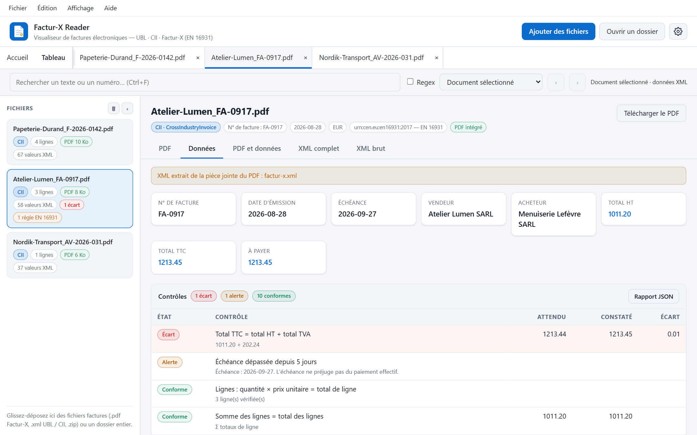
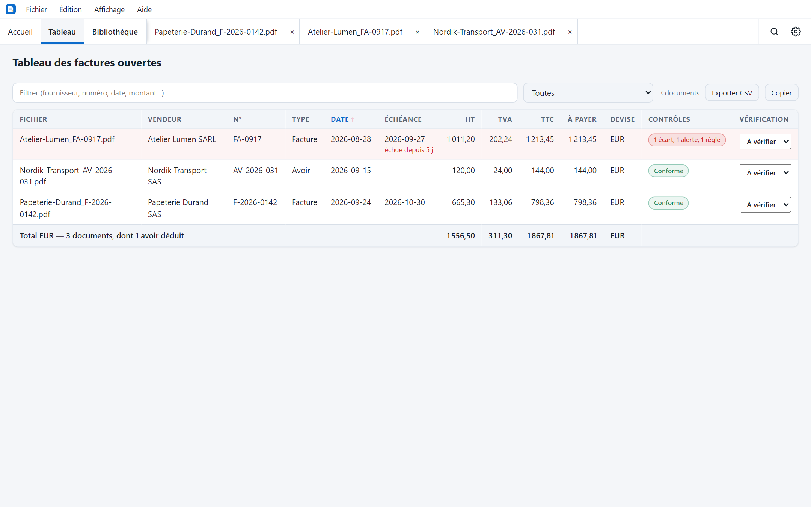
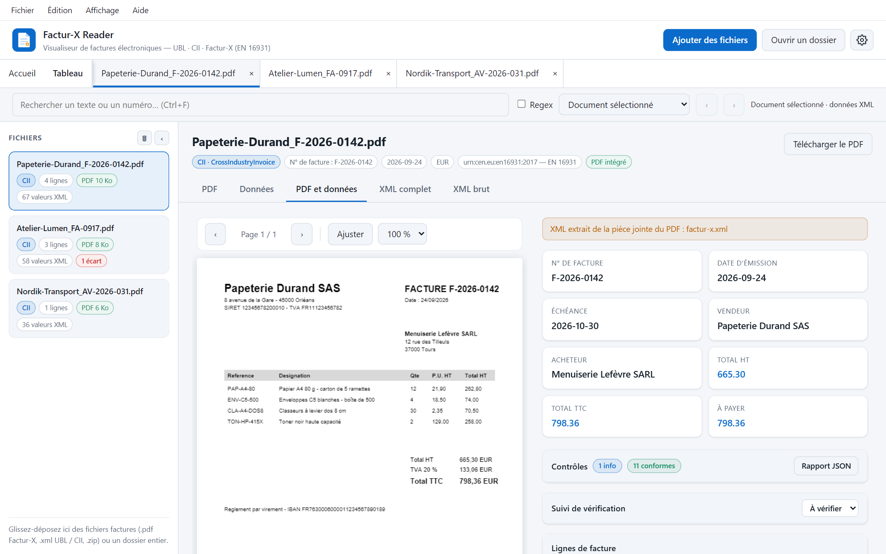

<div align="center">


# Factur-X Reader

**Lisez, contrôlez et exploitez vos factures électroniques, sans que rien ne quitte votre poste.**

Application de bureau légère pour Factur-X, UBL et CII (EN 16931) — Windows, macOS et Linux.

[](https://github.com/simongrossi/FacturX-Reader/releases)
[](https://github.com/simongrossi/FacturX-Reader/actions/workflows/checks.yml)
[](https://github.com/simongrossi/FacturX-Reader/releases)
[](LICENSE.md)


[**Télécharger**](https://github.com/simongrossi/FacturX-Reader/releases) ·
[Fonctionnalités](#fonctionnalités) ·
[Comparatif](#comparatif) ·
[Utilisation](#utilisation) ·
[Roadmap](ROADMAP.md) ·
[Changelog](CHANGELOG.md)



</div>

## En bref

Déposez une facture, ou un dossier entier. Factur-X Reader affiche le PDF, traduit le XML en
tableaux lisibles en français, **recalcule les montants** et signale ce qui ne colle pas.

- **100 % local** : aucun serveur, aucun appel réseau, aucun compte. La bibliothèque est un
  fichier sur votre poste, désactivable.
- **Léger** : installeur Windows d'environ 5 Mo, exécutable d'environ 19 Mo, moteur de validation
  et règles officielles compris.
- **Pensé pour vérifier**, pas seulement pour afficher : contrôles, pointage, suivi, exports.

> Version de développement (0.y.z). Les builds ne sont pas signés : Windows SmartScreen et
> macOS Gatekeeper affichent un avertissement au premier lancement.

## Fonctionnalités

| | |
|---|---|
| 📄 **Lecture** | PDF Factur-X, archive ZIP, XML UBL 2.x et CII. PDF d'origine, données en tableaux, XML complet et XML brut. |
| 🏛️ **Schematron officiel** | Les règles officielles EN 16931 de la Commission européenne, exécutées sur votre poste, sans envoyer la facture où que ce soit. |
| 🧱 **Schéma XSD** | La structure du XML contrôlée contre le schéma officiel : celui du profil Factur-X annoncé pour le CII, UBL 2.1 pour l'UBL. Sur votre poste. |
| 📎 **Conteneur PDF** | PDF/A-3 annoncé, pièce jointe XML déclarée, profil annoncé comparé à celui du XML ; polices incorporées, chiffrement, profil de sortie, métadonnées Factur-X contrôlés dans le fichier. |
| 📐 **Règles EN 16931** | Une soixantaine de règles métier de la norme évaluées sur chaque facture : mentions obligatoires, calculs, décimales, catégories de TVA. |
| ✅ **Contrôles de cohérence** | Calculs en décimaux exacts : lignes, HT, TVA par taux, TTC, net à payer. Mentions essentielles, clés SIREN/SIRET, n° de TVA et IBAN, échéance, escompte. |
| 📊 **Tableau multi-factures** | Toutes les factures ouvertes sur une page : totaux par devise, avoirs déduits, filtres d'anomalies, de période, de montant et de fournisseur, export CSV. |
| 🗄️ **Bibliothèque locale** | Toutes les factures déjà ouvertes, retrouvables entre les sessions. Signale un IBAN nouveau pour un fournisseur, un doublon dans l'historique, une variation de prix unitaire. |
| 🪟 **PDF et données côte à côte** | Vérifiez une ligne sans changer d'onglet. |
| 🖊️ **Pointage et suivi** | Pointage des lignes, statut À vérifier / Vérifiée / Anomalie, commentaires par facture et par ligne. |
| 🔎 **Recherche** | Texte ou regex, dans le document ou dans tous les documents ouverts, avec surlignage. |
| 📤 **Exports** | Lignes et tableau en CSV ou Excel (.xlsx), rapport de contrôle en JSON ou PDF, copie en CSV, JSON ou Markdown par clic droit. |
| 🖨️ **Impression** | La vue affichée (données, contrôles, tableau, PDF) sans l'habillage de l'application. |
| 🗂️ **Confort** | Onglets par document, reprise de session, documents récents, barre de menus, thèmes clair et sombre. |

<table>
<tr>
<td width="50%"></td>
<td width="50%"></td>
</tr>
<tr>
<td align="center"><sub>Tableau multi-factures : totaux, avoirs déduits, anomalies</sub></td>
<td align="center"><sub>PDF et données côte à côte</sub></td>
</tr>
</table>

<sub>Captures réalisées avec des factures entièrement fictives (`npm run screenshots`).</sub>

## Comparatif

Comparaison avec des outils gratuits courants pour ouvrir une facture électronique. Même quand
une case est cochée des deux côtés, le niveau de détail peut différer.

| | Factur-X Reader | [Quba Viewer](https://github.com/ZUGFeRD/quba-viewer) | [Mustang](https://www.mustangproject.org/) | Lecteur PDF classique |
|---|:---:|:---:|:---:|:---:|
| Type | Application de bureau | Application de bureau | Bibliothèque et ligne de commande | Application de bureau |
| Technologie | Rust, Tauri | Electron, XSLT | Java | — |
| Windows, macOS, Linux | ✅ | ✅ | ✅ (Java) | ✅ |
| Fonctionne hors ligne | ✅ | ✅ | ✅ | ✅ |
| Affiche le PDF | ✅ | ✅ | — | ✅ |
| Affiche les données du XML | ✅ | ✅ | HTML (expérimental) | — |
| PDF et données côte à côte | ✅ | ✅ | — | — |
| Plusieurs factures en onglets | ✅ | ✅ | — | — |
| Recherche | ✅ texte et regex | ✅ | — | Texte du PDF |
| Impression | ✅ | ✅ | — | ✅ |
| Contrôles arithmétiques détaillés | ✅ | — | Via la validation | — |
| Schematron officiel EN 16931 et profils Factur-X | ✅ hors ligne | ✅ en ligne | ✅ | — |
| Règles de la réforme française (EXTENDED-CTC-FR, BR-FR) | ✅ hors ligne | — | — | — |
| Validation XSD | ✅ hors ligne | ✅ en ligne | ✅ | — |
| Validation PDF/A-3 du fichier | Partielle : déclarations et sept points de structure | ✅ en ligne | ✅ | — |
| Tableau multi-factures avec totaux | ✅ | — | — | — |
| Pointage, statuts et commentaires | ✅ | — | — | — |
| Historique : alerte de changement d'IBAN, prix, doublons | ✅ | — | — | — |
| Export CSV / rapport JSON | ✅ | — | — | — |
| Lecture de ZUGFeRD 1.x | — | ✅ | ✅ | — |
| Conversion (CII ↔ UBL, ZUGFeRD 1 → 2) | — | — | ✅ | — |
| Création de factures | — | — | ✅ | — |
| Interface en français | ✅ | ✅ | — | Selon l'outil |
| Licence | PolyForm Noncommercial | Apache 2.0 | Apache 2.0 | Selon l'outil |

<sub>Établi le 3 octobre 2026 d'après la documentation publique de chaque projet ; une case vide
signifie « non documenté à cette date », pas forcément « impossible ». Corrections bienvenues.
Factur-X Reader exécute le Schematron officiel EN 16931 et celui des profils Factur-X, et contrôle
le schéma XSD, mais ne contrôle ni la conformité PDF/A-3 complète du fichier, ni les règles
nationales autres que françaises ; son validateur XSD et son moteur Schematron ne sont pas les implémentations de
référence. Pour une validation qui fait foi, Mustang ou Quba restent les bons outils.</sub>

[COMPARATIF.md](COMPARATIF.md) élargit la comparaison aux autres visionneuses (Treesoft, 7-PDF,
Aloaha), aux logiciels de gestion et aux outils en ligne de commande, et liste ce qu'il manque
à l'application.

## Téléchargement

Les installeurs sont sur la page [Releases](https://github.com/simongrossi/FacturX-Reader/releases) :

| Système | Fichier |
|---|---|
| Windows | `Factur-X.Reader_x.y.z_x64-setup.exe` ou `.msi` |
| macOS (Intel et Apple Silicon) | `Factur-X.Reader_x.y.z_universal.dmg` |
| Linux | `.deb`, `.rpm`, `.AppImage` |

Ils sont produits par le workflow GitHub à chaque tag `vX.Y.Z`, ou localement par `npm run build`
(voir [Développement](#développement)).

## Stack

- **Tauri 2** — fenêtre native s'appuyant sur la WebView du système ;
- **Rust** — moteur d'analyse, contrôles de cohérence, persistance des pointages ;
- **SQLite** embarqué — bibliothèque locale ;
- **HTML / CSS / JS sans framework** — le front de `web/` est servi tel quel, sans étape de
  compilation ;
- **xee** — moteur XPath, pour évaluer le Schematron officiel ;
- **uppsala** — validateur XSD ;
- **lopdf** — lecture de la structure des PDF ;
- **PDF.js 3.11** — rendu des PDF.

## Utilisation

### Accueil et reprise du travail

L'onglet **Accueil** propose l'ouverture de fichiers ou d'un dossier, les paramètres,
les cinq derniers documents (« Plus… » affiche la liste complète, la croix en retire un) et la
reprise de la dernière session. Chaque facture possède son propre onglet, avec fermeture par la
croix, clic central ou `Ctrl+W`. `Ctrl+Tab` et `Ctrl+Maj+Tab` passent d'un document à l'autre ;
la molette fait défiler les onglets. Le chevron de la barre d'onglets, ou `Ctrl+E`, ouvre la
**liste des documents ouverts**, filtrable au clavier.

Par défaut, les documents ouverts et le document actif sont restaurés au lancement, avec
leur vue PDF / Données / XML, leur position de défilement et leur zoom mémorisés.
Le réglage **Paramètres → Au démarrage → Afficher l'accueil** permet une reprise manuelle.
Les fichiers passés au lancement prennent priorité sur la restauration automatique.

Les fichiers ouverts par leur chemin sont relus sur le disque. Les fichiers choisis via
le sélecteur web ou déposés sont conservés en copie locale dans IndexedDB pour leur
réouverture ; cette copie ne suit pas les modifications du fichier d'origine.
Les métadonnées de session sont stockées localement dans la WebView. Un fichier manquant
est signalé sans bloquer les autres documents. Les pointages conservent leur stockage habituel.

La session est limitée à **500 documents** et les copies locales à **256 Mo**. Une copie qui
ne peut pas être enregistrée est signalée ; la lecture du document reste possible pour la
session courante, mais sa réouverture exige le fichier d'origine. Les copies qui ne servent
plus aux récents ni à la session sont nettoyées automatiquement. Dans les paramètres,
**Nettoyer les copies inutilisées** et **Effacer l'historique** conservent les documents
nécessaires à la session ; les pointages restent dans leur fichier habituel.

### Ouvrir des factures

| Action | Comment |
|---|---|
| Ajouter des fichiers | bouton **Ajouter des fichiers** ou `Ctrl+O` |
| Ouvrir un dossier (sous-dossiers compris) | bouton **Ouvrir un dossier** ou `Ctrl+Maj+O` |
| Glisser-déposer | des fichiers **ou un dossier** n'importe où dans la fenêtre |
| Ligne de commande | `facturx-reader facture.pdf dossier/ autre.xml` |

Dans un dossier, seuls les `.pdf`, `.xml` et `.zip` sont retenus (500 fichiers au maximum,
dossiers cachés ignorés). Un PDF sans XML de facture apparaît dans la liste avec son erreur.

Dans le panneau **Fichiers** : **🗑** vide la liste, **✕** (au survol) retire un fichier,
**‹ / ›** replie le panneau.

### Exports Excel et rapport PDF

Dans **Données**, utilisez **Exporter Excel** pour les lignes affichées (recherche, tri et filtre de pointage appliqués), ou **Rapport PDF** dans les contrôles. Dans le **Tableau des factures**, **Exporter Excel** reprend les factures filtrées et ajoute une feuille de totaux par devise, avec les avoirs déduits. Ces actions sont aussi dans le menu **Fichier**.

Les montants Excel sont numériques ; les numéros et références restent du texte. Les valeurs dépassant 15 chiffres significatifs restent textuelles pour éviter un arrondi par Excel. Le rapport PDF contient la synthèse, les verdicts et limites des contrôles, les diagnostics et le suivi manuel. Les résultats encore en cours sont ceux de l’instant de l’export : réexportez après leur achèvement. Tous les fichiers sont générés localement, sans réseau.

### Formats pris en charge

| Format | Détection | PDF affiché |
|---|---|---|
| Factur-X (PDF) | PDF avec pièce jointe XML (`/Filespec`) UBL ou CII | le PDF lui-même |
| Factur-X (archive ZIP) | ZIP contenant un XML UBL/CII (+ PDF) ; s'il contient plusieurs XML ou plusieurs PDF, l'application demande lesquels ouvrir | extrait du ZIP, ou aucun si vous ouvrez le XML seul |
| UBL 2.x (`Invoice`, `CreditNote`) | racine du XML | base64 intégré (`EmbeddedDocumentBinaryObject`) |
| CII (`CrossIndustryInvoice`) | racine du XML, variantes EN 16931 et UN/CEFACT classique | base64 intégré |

**Limites à l'import** : 200 Mo par fichier ; 32 Mo pour le XML une fois décompressé, qu'il vienne
d'un ZIP ou d'un PDF ; 2000 entrées par archive. Au-delà, le fichier est refusé avec un message,
plutôt que décompressé sans borne. Un PDF dont une pièce jointe dépasse ce plafond est refusé en
entier.

Types de facture, unités (UN/ECE), modes de paiement, catégories de TVA et profils sont
traduits en français. Un champ non reconnu est affiché avec son étiquette brute et son chemin.

### Onglets

La barre de recherche rapide (`Ctrl+F`, ou `Cmd+F`) recherche dans les champs, valeurs,
attributs et chemins XML. Le sélecteur de portée propose **Document sélectionné** (par défaut)
ou **Tous les documents ouverts**. En mode document, changer d'onglet de facture relance
la recherche sur cette facture. Sur l'accueil, sélectionnez une facture ou passez en mode tous
les documents ; la recherche ne change pas de portée implicitement.
L'option **Regex** accepte une
expression régulière, sans délimiteurs (ex. `FAC-2026-\d+`). La recherche ignore la casse.
Chaque résultat ouvre la facture dans **XML complet** et surligne l'élément en jaune.
Utilisez les flèches ou `Entrée` / `Maj+Entrée` pour naviguer ; `Échap` efface la recherche.
Les PDF et les contenus binaires ne sont pas recherchés. Les regex trop lentes sont interrompues.
Le compteur compte les éléments XML correspondants, pas les occurrences dans chaque valeur.
Le surlignage jaune porte sur la ligne de l'élément trouvé.

- **PDF** — rendu du PDF (pages, ajuster, zoom, enregistrer).
- **PDF du XML** — présent quand le XML embarque un PDF distinct du fichier déposé.
- **PDF et données** — les deux côte à côte, chacun avec son défilement (présent quand la
  facture a un PDF).
- **Données** — synthèse (n°, dates, vendeur, acheteur, totaux), lignes de facture, puis détail
  vendeur / acheteur / livraison / paiement / totaux. Chaque cellule est cliquable : valeur,
  chemin XML, copie, saut vers la ligne correspondante dans « XML complet ».
- **XML complet** — toutes les valeurs du document dans l'ordre, avec filtre instantané.
- **XML brut** — XML réindenté (préfixes d'origine conservés), recherche avec surlignage.

Sur le tableau des **lignes de facture** :

- **Tri** par clic sur un en-tête de colonne ;
- **Recherche** en direct (compteur « N / total ») ;
- **Pointage** d'une ligne (pastille à gauche), filtre *Toutes / Pointées / Non pointées*,
  effacement des pointages ;
- **Détail** d'une ligne : tous ses champs XML, y compris les balises propres à un fournisseur ;
- **Colonnes de note** : une note de ligne de la forme `libellé : valeur | libellé : valeur`
  est éclatée en colonnes.

### Verdicts

En tête de l'onglet **Données**, une **synthèse** dit d'abord ce qui demande une action : le
nombre de familles de contrôles à examiner, le nombre de contrôles incomplets ou en cours, et un
bouton par point qui ouvre le bloc concerné. Suivent des verdicts indépendants, jamais fondus en
un seul « conforme » :

| Verdict | Ce qu'il dit | Ce qu'il ne dit pas |
|---|---|---|
| **Lecture réussie** | Le XML a été trouvé et ses données extraites | Que le fichier est un Factur-X valide |
| **Calculs cohérents** | Les montants du XML se recalculent sans écart | Que la facture respecte la norme |
| **Règles EN 16931 respectées** | Les règles métier évaluées par le moteur de l'application passent | Que le Schematron officiel passerait |
| **Schematron officiel respecté** | Aucune règle bloquante du Schematron officiel (EN 16931, profil Factur-X ou EXTENDED-CTC-FR annoncé) n'est enfreinte | Que le XML respecte le schéma XSD ou les règles nationales |
| **Règles françaises BR-FR respectées** | Les règles de la réforme française passent, pour une facture au profil EXTENDED-CTC-FR ou entre deux parties en France | Que la réforme s'applique bien à cette facture |
| **Schéma XSD respecté** | La structure du XML suit le schéma officiel : éléments connus, à leur place, valeurs du bon type | Que les montants sont justes ou les règles métier respectées |
| **PDF/A-3 déclaré, structure sans anomalie relevée** | Le PDF s'annonce PDF/A-3, déclare sa pièce jointe XML et passe les sept contrôles de structure | Que le fichier est conforme à ISO 19005-3 : la norme comporte bien d'autres exigences |

Les autres constats (identifiants, échéance, doublons, IBAN) sont comptés à part comme alertes.
**Non contrôlés** : la conformité PDF/A-3 complète du fichier et les règles nationales autres
que françaises (XRechnung, Peppol…). Aucun de ces verdicts ne vaut certification. La fiche, le
tableau multi-factures et le rapport JSON tirent leurs verdicts du même calcul : une anomalie
visible dans l'un l'est dans les autres.

### Schematron officiel

L'application embarque les règles de validation officielles de la norme EN 16931, publiées par la
Commission européenne (dépôt [`eInvoicing-EN16931`](https://github.com/ConnectingEurope/eInvoicing-EN16931),
version 1.3.16), pour les deux syntaxes CII et UBL : 806 règles CII et 979 règles UBL. Elles sont
évaluées **sur votre poste** par le moteur de l'application, en Rust, à l'aide du moteur XPath
open source `xee` : la facture n'est envoyée nulle part, et aucun code n'est exécuté dans la
fenêtre.

Le bloc **Schematron officiel** de l'onglet Données liste chaque règle non respectée (bloquante)
et chaque avertissement, avec l'identifiant officiel (`BR-CO-15`, `UBL-CR-528`, `CII-SR-173`…),
le texte de la règle et son emplacement dans le XML.

À savoir :

- seules les factures dont la racine est un `CrossIndustryInvoice` CII ou un `Invoice` /
  `CreditNote` UBL aux espaces de noms standard sont validées. Sur tout autre document, le
  verdict est **« non évalué »**, jamais « respecté » ;
- la validation porte sur le **XML d'origine**, tel qu'il figure dans le fichier, et non sur la
  version réindentée que l'application affiche (où les pièces jointes binaires sont abrégées).
  Si le moteur ne parvient pas à lire l'original, la version réindentée est évaluée à sa place et
  le bloc le signale ;
- elle tourne en arrière-plan, sans bloquer l'interface : quelques dizaines de millisecondes pour
  une facture courante, environ 0,4 s pour une facture de plus de cent lignes (huit à onze fois
  moins que dans la 0.6.0). À l'ouverture d'un dossier, plusieurs documents sont validés de
  front, celui qui est affiché en premier ;
- le résultat est gardé dans la [bibliothèque locale](#bibliothèque-locale), par empreinte du
  XML, et repris à la réouverture au lieu d'être recalculé. Il n'est repris que pour les mêmes
  règles et la même version de l'application ; bibliothèque désactivée, rien n'est gardé ;
- si une valeur du XML n'a pas le format attendu (un montant non numérique, par exemple), les
  règles qui en dépendent sont listées comme **non évaluables** et le verdict n'est pas
  « respecté » ;
- une facture CII qui annonce un profil Factur-X **MINIMUM**, **BASIC WL**, **BASIC** ou
  **EXTENDED** est évaluée avec les règles officielles Factur-X de ce profil (version 1.09.2,
  publiées par FNFE-MPE et FeRD), et non avec celles de la Commission : 66, 337, 472 et 1464
  règles. Le pied du bloc nomme le jeu de règles appliqué ;
- une facture CII ou UBL au profil français **EXTENDED-CTC-FR** (réforme de la facture
  électronique, norme XP Z12-012) est évaluée avec les règles de ce profil publiées par le
  FNFE-MPE (dépôt [`France_RFE`](https://github.com/fnfempe/France_RFE), version 1.4.0.04) : 773
  règles CII, 953 règles UBL ;
- les règles **BR-FR** de la réforme française (même dépôt, même version : 171 règles CII, 175
  règles UBL — longueur et format des identifiants, SIREN et SIRET, mentions obligatoires en
  France, cadre de facturation…) sont évaluées en plus quand la facture relève de la réforme :
  profil EXTENDED-CTC-FR, ou **vendeur et acheteur tous deux en France**. Une facture étrangère,
  ou adressée à l'étranger, n'y est pas soumise. Elles ont **leur propre verdict**, « Règles
  françaises BR-FR », et leur propre liste en bas du bloc : elles ne changent pas le verdict du
  Schematron. Ce critère est en effet un choix de l'application, qui ne tient pas compte des cas
  particuliers de la réforme (B2C, opérations exonérées de l'obligation, calendrier d'entrée en
  vigueur selon la taille de l'entreprise) ; une règle BR-FR non respectée est donc signalée en
  alerte, pas en écart ;
- le profil EN 16931, XRechnung et tout autre CII ou UBL gardent les règles de la Commission ;
- le profil EXTENDED tolère un centime d'écart sur certains calculs : une facture EXTENDED peut
  respecter son Schematron alors que les [règles natives](#règles-en-16931), qui appliquent la
  norme EN 16931 stricte, signalent cet écart ;
- les règles Factur-X signalent sans identifiant les éléments qu'un profil n'emploie pas ;
  l'application les liste sous `FX-NON-UTILISE`. Leurs listes de codes, publiées dans un fichier
  à part, sont intégrées aux règles au chargement, à sens égal.

Ce moteur n'est pas l'implémentation de référence : c'est une évaluation directe des règles
officielles. Il a été comparé à SaxonJS, le moteur XSLT de référence, sur 583 documents (exemples
officiels, variantes abîmées, factures réelles) : mêmes règles enfreintes, en même nombre, dans
578 cas ; dans les 5 autres, SaxonJS s'arrête sur une valeur illisible là où l'application
continue et signale les règles non évaluables. La suite de tests officielle de la Commission
(1169 cas, presque tous UBL) est rejouée à chaque `cargo test` : chaque règle y donne le résultat
attendu.

Le Schematron ajoute aux règles métier les règles de syntaxe (`UBL-CR`, `UBL-SR`, `CII-SR`) que
les [règles natives](#règles-en-16931) de l'application ne couvrent pas.

### Schéma XSD

Pour une facture CII (donc pour tout Factur-X), l'application contrôle la structure du XML contre
le schéma officiel du profil que la facture annonce :

| Profil annoncé | Schéma appliqué |
|---|---|
| MINIMUM, BASIC WL, BASIC, EN 16931, EXTENDED | Le schéma de ce profil, publié par FNFE-MPE et FeRD (Factur-X 1.09.2) |
| Autre CII : EXTENDED-CTC-FR, XRechnung, profil inconnu ou absent | Le schéma UN/CEFACT complet du Cross Industry Invoice D22B |

Une facture annoncée BASIC qui contient un élément réservé à EXTENDED est donc signalée. Une
facture ou un avoir **UBL** est contrôlé contre le schéma OASIS UBL 2.1 correspondant. Le
bloc **Schéma XSD** de l'onglet Données liste chaque erreur avec sa
ligne dans l'onglet « XML brut » : élément inconnu ou mal placé, attribut non prévu, valeur d'un
mauvais type.

À savoir :

- le contrôle porte sur le **XML d'origine** et prend environ une milliseconde. Les numéros de
  ligne affichés sont ceux de l'onglet « XML brut » ; si l'original et sa version réindentée ne
  donnent pas les mêmes erreurs, ce sont celles de l'original qui sont listées, avec ses propres
  numéros de ligne, et le bloc le précise ;
- Factur-X repose depuis la version 1.0.07 sur le CII D22B, qui accepte toute facture D16B ; un
  destinataire resté au schéma D16B peut refuser une facture que l'application juge valide
  (plusieurs références à des factures antérieures, par exemple) ;
- les messages viennent du validateur open source `uppsala` et sont en anglais. Ce validateur
  est jeune : il a été vérifié ici sur les 15 exemples CII officiels de la Commission, sur des
  factures réelles et sur des fichiers abîmés exprès, mais pas comparé à un validateur de référence comme Xerces. Un
  faux positif connu (un nombre écrit `100.`) est écarté par l'application.

### Conteneur PDF

Pour une facture reçue en PDF, l'application lit la structure du fichier et signale :

| Contrôle | Ce qui est lu |
|---|---|
| **PDF/A-3 déclaré dans les métadonnées** | `pdfaid:part` et `pdfaid:conformance` des métadonnées XMP |
| **Pièce jointe XML déclarée** | Présence du XML dans le catalogue du PDF (`/AF` ou `/EmbeddedFiles`) et sa relation (`AFRelationship`) |
| **Profil Factur-X annoncé** | Le niveau annoncé dans les métadonnées, comparé au profil du XML |

Ces trois premiers contrôles portent sur les **déclarations** du fichier. Sept autres sont
faits dans la structure du PDF lui-même :

| Contrôle | Ce qui est vérifié |
|---|---|
| **PDF non chiffré** | Aucun chiffrement, interdit en PDF/A |
| **Profil de sortie (couleurs)** | Un `OutputIntent` PDF/A avec son profil ICC incorporé |
| **Polices incorporées** | Chaque police du fichier a son programme incorporé ; les polices manquantes sont nommées |
| **Identifiant du fichier** | Présence de l'identifiant `/ID` |
| **Aucun script ni lancement de programme** | Aucune action JavaScript ou `Launch` |
| **Métadonnées Factur-X** | `DocumentType`, `DocumentFileName`, `Version` et `ConformanceLevel` présents, nom concordant avec la pièce jointe |
| **Pièce jointe : relation et type** | Relation `Data`, `Source` ou `Alternative` ; type `text/xml` |

C'est un **contrôle partiel** : ISO 19005-3 comporte bien d'autres exigences (espaces
colorimétriques de chaque page, transparence, structure des flux, annotations…) que l'application
ne vérifie pas. Un fichier sans anomalie relevée ici peut être refusé par un validateur complet
comme veraPDF ; une anomalie relevée ici, en revanche, est une vraie non-conformité. Si le PDF
n'est lisible que par le parseur de secours, ces sept contrôles ne sont pas faits. Un XML ou un
ZIP n'a pas de conteneur : ces contrôles n'y apparaissent pas.

### Contrôles

L'onglet **Données** affiche un bloc **Contrôles**, déplié dès qu'il y a un écart ou une alerte :

- **Calculs** en décimaux exacts : quantité × prix unitaire = total de ligne, somme des lignes,
  total HT, TVA par taux, total TVA, total TTC, net à payer. Un écart d'un centime est signalé ;
  seul l'arrondi du prix unitaire est toléré sur les lignes, et un centime sur la TVA par taux.
- **Mentions essentielles** : numéro, date, type, devise, vendeur, acheteur.
- **Identifiants** : clé de contrôle du SIREN/SIRET, du n° de TVA français et de l'IBAN.
- **Dates** : échéance dépassée ou à venir, gain d'escompte si le XML le décrit.
- **Doublons** parmi les documents ouverts : XML identique, ou même vendeur et même numéro.

Chaque ligne donne l'attendu, le constaté et l'écart ; un clic ouvre l'élément dans « XML complet ».
Les états sont *conforme*, *écart*, *alerte*, *info* et *non vérifiable* (donnée absente du XML).
Une facture avec écart porte une pastille rouge dans la liste des fichiers.

Ces contrôles ne sont pas une validation EN 16931 : celle-ci relève du
[Schematron officiel](#schematron-officiel) et du [schéma XSD](#schéma-xsd). Aucun appel
réseau : l'existence du SIREN ou la propriété de l'IBAN ne sont pas vérifiées.

### Règles EN 16931

Le bloc **Règles EN 16931** de l'onglet Données liste les règles métier de la norme évaluées
sur la facture, celles qui ne sont pas respectées en premier, avec leur identifiant officiel
(`BR-07`, `BR-CO-15`, `BR-S-08`…). Un clic ouvre l'élément concerné dans « XML complet ».

| Famille | Ce qui est vérifié |
|---|---|
| `BR-01` à `BR-16` | Mentions obligatoires : identifiant de spécification, numéro, date, type, devise, vendeur, acheteur, adresses, totaux, au moins une ligne |
| `BR-21` à `BR-27` | Chaque ligne : identifiant, quantité, unité, montant net, nom de l'article, prix net non négatif |
| `BR-31` à `BR-38`, `BR-45` à `BR-49`, `BR-61` | Remises et frais de niveau document, ventilation de TVA, moyen de paiement |
| `BR-CO-03` à `BR-CO-26` | Calculs et cohérence : sommes, total HT, TVA, TTC, montant à payer, échéance, identification du vendeur |
| `BR-DEC` | Montants à deux décimales au plus |
| `BR-S`, `BR-Z`, `BR-E`, `BR-AE`, `BR-IC`, `BR-G`, `BR-O` | Règles par catégorie de TVA : ventilation présente, identifiants fiscaux, taux, base, montant, motif d'exonération |

Limites, à connaître avant de s'y fier :

- c'est une **implémentation native** écrite d'après l'énoncé des règles ; elle sert aux verdicts
  instantanés, au tableau et à la bibliothèque. En cas de désaccord, le
  [Schematron officiel](#schematron-officiel) fait foi ;
- **non couverts** par ce moteur natif : les listes de codes (hors catégories de TVA) et les
  règles de syntaxe ;
- pour les profils Factur-X **MINIMUM** et **BASIC WL**, hors norme EN 16931, seules les règles
  qui ont un objet sont évaluées ; le Schematron officiel, lui, applique les règles de ces profils.

Les factures qui enfreignent une règle portent une pastille dans la liste et se filtrent dans le
tableau. Le rapport JSON contient le détail de toutes les règles.

### Impression

**Fichier → Imprimer** (`Ctrl+P`) imprime la vue affichée : données et contrôles, tableau des
factures, XML ou pages du PDF. L'habillage de l'application est retiré, les blocs repliés sont
dépliés et le thème clair est utilisé le temps de l'impression.

### Suivi de vérification et rapport

Sous les contrôles, le bloc **Suivi de vérification** porte un statut manuel (*À vérifier*,
*Vérifiée*, *Anomalie*), un commentaire de facture, des commentaires par ligne et le bouton
**Pointer toutes les lignes**. Ce suivi est enregistré localement, associé à l'empreinte du XML ;
il ne dit rien du paiement. Le statut se retrouve dans le tableau multi-factures. Voir
[Protection des pointages et du suivi](#protection-des-pointages-et-du-suivi).

**Rapport JSON** (en-tête du bloc Contrôles, ou menu Fichier) enregistre la synthèse de la
facture, les verdicts, tous les contrôles (doublons compris), les règles EN 16931, le résultat du
Schematron, le détail des règles françaises, le schéma XSD, le conteneur PDF et le suivi de
vérification.

### Export des lignes

**Exporter CSV** enregistre les lignes affichées (recherche, filtre de pointage et tri appliqués)
dans un fichier lisible par Excel : séparateur point-virgule, UTF-8, décimale française, devise
dans sa propre colonne, colonne « Pointée ». **Copier** place le même tableau dans le presse-papiers.

### Tableau multi-factures

Dès qu'un document est ouvert, l'onglet **Tableau** (à côté d'Accueil) liste toutes les factures
ouvertes : fichier, vendeur, numéro, type, date, échéance, HT, TVA, TTC, à payer, devise et une
colonne par verdict (calculs, règles EN 16931, Schematron, schéma XSD, règles françaises,
conteneur PDF, alertes). Un clic sur une ligne ouvre la facture.

- **Tri** par clic sur un en-tête, **filtre** texte.
- **Filtres métier** : période (date d'émission), plage de montants TTC, fournisseur ;
  « Effacer filtres » les remet à zéro.
- **Filtre d'anomalies** : écart de calcul, alerte, règle EN 16931, Schematron ou schéma XSD non
  respecté, règles françaises à examiner, contrôle incomplet ou en cours, échéance dépassée, sans
  TVA, émise un week-end, doublon, avoirs, documents non lus.
- **Totaux par devise** sur les lignes affichées ; les avoirs sont déduits.
- **Exporter CSV** / **Copier** : le tableau affiché, plus les jours avant échéance et le détail
  des contrôles en écart ou en alerte, des règles Schematron et françaises enfreintes et des
  erreurs de schéma XSD.

Les montants viennent du XML, sans recalcul. Le tableau porte sur les documents ouverts
(500 au maximum), pas sur un historique.

### Bibliothèque locale

Chaque facture analysée est enregistrée dans une base locale (`bibliotheque.sqlite`, dans le
dossier de données de l'application) : numéro, dates, vendeur, acheteur, montants, IBAN et lignes
(référence, désignation, quantité, prix unitaire). Le PDF et le XML n'y sont pas copiés.

L'onglet **Bibliothèque**, à côté d'Accueil et de Tableau, liste ces factures entre les sessions :

- **Recherche** par fournisseur, numéro, date, montant, nom de fichier, référence ou désignation
  d'article ;
- **filtres** par période, plage de montants TTC et fournisseur. Recherche et filtres sont
  appliqués dans la base avant tout découpage : le nombre de résultats affiché est exact, et
  au-delà de 1000 les résultats se parcourent par pages (Précédent / Suivant). Avec une date
  minimale, une facture sans date n'est pas retenue ;
- un clic **rouvre la facture** depuis son emplacement d'origine, après vérification que le
  fichier contient toujours le même XML ;
- **Retrouver le fichier** rétablit le lien quand l'emplacement est inconnu (fichier ajouté par
  dépôt) ou a changé : vous désignez le fichier, l'application vérifie l'empreinte de son XML, et
  refuse un fichier qui ne correspond pas. Aucun original n'est copié ;
- **✕** retire une facture de la bibliothèque, sans toucher au fichier.

À l'ouverture d'une facture, la bibliothèque ajoute trois constats aux contrôles :

| Constat | Déclenchement |
|---|---|
| **IBAN différent des factures précédentes** (alerte) | Le fournisseur a déjà des factures avec un IBAN, et celui de cette facture n'y figure pas. À vérifier auprès du fournisseur par un canal connu avant de payer. |
| **Doublon probable dans la bibliothèque** (alerte) | Même fournisseur et même numéro qu'une facture déjà vue, avec un contenu différent. |
| **Prix unitaire modifié** (info) | Le prix d'un article diffère du dernier prix connu chez ce fournisseur, sur une facture antérieure. |

Le fournisseur est reconnu par son n° de TVA, à défaut son identifiant légal, à défaut son nom.
Un article est reconnu par sa référence, à défaut sa désignation. Dans le détail d'une ligne,
**Historique des prix** montre le prix de l'article sur toutes les factures du fournisseur.

Limites : la bibliothèque ne connaît que les factures ouvertes au moins une fois sur ce poste ;
la première facture d'un fournisseur ne peut donc déclencher aucune alerte. Elle n'est pas
incluse dans l'export des pointages et du suivi : rouvrir un dossier de factures la reconstitue,
sauf les dates de première vue.

*Paramètres → Données* permet de désactiver la bibliothèque, de la vider, ou de la réinitialiser
si la base est illisible (elle est alors conservée à côté, jamais supprimée).

### En-tête et recherche

Sans document ouvert, l'en-tête montre le logo et les boutons d'ouverture. Dès qu'un document
est ouvert, il laisse la place au contenu : les actions restent dans le menu **Fichier**
(`Ctrl+O`, `Ctrl+Maj+O`) et sur l'onglet Accueil. À droite des onglets, la **loupe** ouvre la
barre de recherche (`Ctrl+F`, `Échap` pour la refermer) et la **roue** ouvre les Paramètres.
Les messages affichés sous les onglets se ferment avec leur croix.

### Barre de menus

La barre **Fichier / Édition / Affichage / Aide** regroupe les actions : ouvrir, exporter,
fermer, rechercher, copier, changer de vue ou de document. Les raccourcis y sont rappelés.
Les onglets **Accueil** et **Tableau** restent fixes à gauche de la barre d'onglets.

### Clic droit

Sur un onglet ou un fichier de la liste : ouvrir, fermer, fermer les autres, fermer les
documents en erreur, copier le nom ou le chemin.


Un clic droit sur une cellule de n'importe quel tableau propose : copier la cellule, la ligne
(avec ou sans en-têtes), la colonne ou le tableau affiché ; copier la ligne ou le tableau en
**CSV**, **JSON** ou **Markdown** ; copier le chemin XML, voir l'élément dans « XML complet »,
rechercher la valeur. Les champs de saisie gardent le menu du système (couper, copier, coller).

### Pointages

Les lignes pointées sont enregistrées automatiquement et retrouvées à la réouverture de la même
facture. Elles sont indexées par l'empreinte SHA-256 du XML, dans `pointages.json` :

| Système | Emplacement |
|---|---|
| Windows | `%APPDATA%\com.simongrossi.facturxreader\` |
| macOS | `~/Library/Application Support/com.simongrossi.facturxreader/` |
| Linux | `~/.local/share/com.simongrossi.facturxreader/` |

Le **suivi de vérification** (statuts et commentaires) est enregistré de la même façon dans
`suivi.json`, dans le même dossier.

**Mode portable** : si un `pointages.json` ou un `suivi.json` se trouve à côté de l'exécutable,
c'est lui qui est utilisé. Le chemin effectif est affiché dans les Paramètres.

### Protection des pointages et du suivi

- **Sauvegarde quotidienne** : avant la première modification de chaque jour, le fichier est copié
  en `pointages.sauvegarde-AAAA-MM-JJ.json` (ou `suivi.sauvegarde-…`). Les sept dernières sont
  conservées.
- **Un fichier illisible n'est jamais écrasé** : s'il est corrompu ou vide, l'application le
  signale dès le démarrage, refuse toute écriture et n'affiche pas un historique vide à la place.
- **Restauration** : *Paramètres → Données → Restaurer la dernière sauvegarde* remet en place la
  sauvegarde lisible la plus récente. Le fichier illisible est conservé à côté, renommé
  `…illisible-<date>.json`.
- **Exporter / Importer** : un seul fichier JSON contient pointages et suivi. L'import fusionne :
  une entrée absente est ajoutée, une entrée existante n'est remplacée que si celle du fichier
  est plus récente.

Les suivis saisis avec la version 0.4.0, alors stockés dans la WebView, sont repris dans
`suivi.json` au premier lancement.

### Paramètres

Le bouton **⚙** (ou `Ctrl+,`) ouvre les Paramètres ; chaque réglage est appliqué immédiatement
et mémorisé :

- **Thème** — Clair (défaut), Sombre, Système (suit l'OS) ou Girl ;
- **Densité des tableaux** — Confortable ou Compacte ;
- **Onglet affiché en premier** — PDF ou Données ;
- **Zoom du PDF par défaut** — 75 % à 200 %, ou « Ajuster à la largeur » ;
- **Fichier des pointages** — emplacement, avec copie du chemin ;
- **Pointages et suivi de vérification** — état des fichiers, export, import, restauration.

## Développement

Prérequis : [Rust](https://rustup.rs), Node.js et les
[dépendances système de Tauri](https://tauri.app/start/prerequisites/) (WebView2 sous Windows,
`libwebkit2gtk-4.1` sous Linux).

```bash
npm install      # une fois : installe la CLI Tauri
npm run dev      # lance l'application en développement
npm run build    # exécutable + installeurs dans src-tauri/target/release/bundle/
```

### Développement sous macOS

Un essai manuel sous macOS a confirmé le bon fonctionnement général le 4 octobre 2026.
Quelques détails de présentation restent à améliorer. Cet essai ne constitue pas une
vérification exhaustive des fonctions ni des installeurs ; voici les commandes de développement.

```bash
xcode-select --install          # outils de compilation, une fois
# Rust : https://rustup.rs — Node.js : version LTS
npm ci
npm run dev                     # lance l'application
cargo test --manifest-path src-tauri/Cargo.toml
npx playwright install chromium
npm run test:ui
```

- `npm run test:native` ne fonctionne que sous Windows : il pilote WebView2. Il n'a pas
  d'équivalent macOS.
- `samples/` (factures réelles) n'est pas dans le dépôt : sans ce dossier, le test
  `tests/samples.rs` et les essais sur factures réelles sont sans effet. Copiez-le depuis le poste
  d'origine si vous en avez besoin.
- Les schémas XSD sont écrits dans le dossier temporaire du système le temps de leur chargement :
  à vérifier sous macOS.
- L'application installée depuis le `.dmg` n'est pas signée : au premier lancement, Gatekeeper la
  bloque ; clic droit sur l'application, puis **Ouvrir**.
- Données de l'application : `~/Library/Application Support/com.simongrossi.facturxreader/`.

### Structure

```
web/                       interface (aucune étape de compilation)
  index.html, app.js, style.css
  controls.js              verdicts et synthèse, communs à la fiche, au tableau et au rapport
  imports.js               choix du XML et du PDF dans une archive ambiguë
  workspace.js             accueil, onglets, session
  batch.js                 tableau multi-factures
  review.js                suivi de vérification, rapport de contrôle
  library.js               bibliothèque locale, historique des prix
  schematron/              appel du validateur, notices de licence
  menu.js                  menus contextuels (tableaux, onglets)
  menubar.js               barre de menus
  pdfjs/                   PDF.js embarqué
src-tauri/
  src/facturx.rs           moteur : PDF Factur-X, ZIP, UBL, CII
  src/facturx/controles.rs contrôles de cohérence (décimaux exacts)
  src/facturx/imports.rs   plafonds de décompression, entrées d'une archive
  src/facturx/en16931.rs   règles métier EN 16931
  src/schematron.rs        Schematron officiel EN 16931 (évaluation XPath, fils de travail)
  schematron/              règles officielles EN 16931 (EUPL 1.2) et Factur-X (Apache 2.0), exemples, suite de tests
  src/xsd.rs               schéma XSD des factures CII et UBL
  xsd/                     schémas XSD officiels : profils Factur-X 1.09.2, CII D22B, UBL 2.1
  src/tables.rs            libellés français et tables de codes
  src/pointages.rs         pointages et suivi : persistance, sauvegardes, export/import
  src/bibliotheque.rs      bibliothèque locale (SQLite) : historique, IBAN, doublons, prix
  src/lib.rs               commandes exposées au front
  examples/dump.rs         export JSON d'une facture
  tests/samples.rs         test sur les factures de samples/
  tauri.conf.json          fenêtre, CSP, bundles
samples/                   factures réelles pour les tests locaux (non versionné)
.github/workflows/         build des installeurs Windows / macOS / Linux
```

### Tests

Les tests de l'interface ont leur dépendance Playwright dans `package-lock.json` :

```bash
npm ci
npx playwright install chromium
npm run check:js
npm run test:ui
npm run test:rust
```

La comparaison des validateurs à **SaxonC-HE et libxml2** se lance avec
`npm run test:reference`, après installation de son environnement Python. Elle couvre les
profils Factur-X, les règles françaises et les huit schémas XSD sur des exemples et des variantes
invalides. Voir [tests/reference/README.md](tests/reference/README.md) pour les prérequis et
[le bilan](tests/reference/REPORT.md) pour les résultats et les limites.

Pour utiliser Edge déjà installé sous PowerShell :

```powershell
$env:PLAYWRIGHT_CHANNEL = 'msedge'
npm run test:ui
```

Le workflow `.github/workflows/checks.yml` lance les tests navigateur et Rust à chaque push
et pull request. Les tests navigateur simulent uniquement les commandes Rust ; le rendu
PDF utilise le vrai PDF.js et une facture synthétique de deux pages. Dix-huit scénarios couvrent
la session et la recherche, les quotas et les 500 documents, les contrôles et l'export CSV, le
tableau et ses filtres, les menus, le suivi et le rapport, les règles EN 16931 et l'impression,
la protection des pointages, la bibliothèque et sa pagination, les verdicts du Schematron, le
schéma XSD, les contrôles partagés entre les vues, l'archive ambiguë et « Retrouver le fichier ».

Le workflow lance aussi le test natif ci-dessous, sur le vrai exécutable Windows. Sur la machine
de GitHub, WebView2 ignore les arguments ajoutés de l'extérieur (variable d'environnement,
registre) ; le port de débogage dont le test a besoin y est donc inscrit dans la configuration de
la fenêtre au moment de la compilation de test (`TAURI_CONFIG`). Les installeurs publiés viennent
du workflow `Release`, qui ne le fait pas.

Sous Windows, un test distinct lance le véritable exécutable dans un profil WebView2 jetable,
sans changer la session ni les données de l'utilisateur. Il valide le moteur Rust, la reprise
après relance, le tableau, les contrôles, le Schematron officiel, le schéma XSD, la bibliothèque SQLite et ses filtres, le rapport complet, la synthèse, la réassociation d'un fichier par son empreinte, le plafond de décompression, le suivi
et la restauration de fichiers de données corrompus :

```powershell
cargo build --manifest-path src-tauri/Cargo.toml
npm run test:native
# Pour le binaire de production déjà construit :
$env:FACTURX_TEST_EXE = 'src-tauri/target/release/facturx-reader.exe'
npm run test:native
```

Le port de débogage WebView2 est activé uniquement par ce processus de test, avec un profil
temporaire supprimé à la fin. La variable `FACTURX_DATA_DIR` y place aussi pointages et suivi :
le test n'écrit jamais dans vos données. L'exécutable embarque l'interface à la compilation :
relancez `cargo build` après toute modification de `web/`. La vérification native macOS/Linux et l'installation des
paquets se font séparément sur leurs systèmes respectifs.

```bash
cd src-tauri
cargo test
```

- tests unitaires : moteur (UBL, CII, ZIP, PDF, conteneur), contrôles en décimaux, règles
  EN 16931, Schematron officiel (toutes les règles se compilent, exemples officiels, suite de
  tests officielle de 1169 cas, mêmes résultats avec et sans optimisations), schéma XSD,
  pointages et suivi, bibliothèque ;
- `tests/samples.rs` analyse chaque fichier de `samples/` : il doit donner une facture UBL ou
  CII avec des lignes. Un fichier dont le nom contient `PAS DE XML` doit au contraire être
  rejeté. Sans dossier `samples/`, ce test est sans effet.

`samples/` contient des **factures réelles** : il est exclu du dépôt par `.gitignore`. Pour
couvrir un nouveau fournisseur, il suffit d'y déposer une de ses factures.

Pour inspecter ce que le moteur extrait d'un fichier :

```bash
cd src-tauri
cargo run --example dump -- ../samples/facture.pdf > facture.json
```

### Commandes exposées au front

| Commande | Rôle |
|---|---|
| `parse_file` | analyse des octets reçus (fichier choisi ou déposé) |
| `parse_path` | analyse d'un fichier désigné par son chemin |
| `pick_folder` | sélecteur de dossier natif, renvoie les fichiers factures trouvés |
| `startup_paths` | fichiers et dossiers passés en ligne de commande |
| `get_pointage` / `set_pointage` / `clear_pointage` | pointages d'une facture |
| `get_reviews` / `set_review` | suivi de vérification |
| `data_status` / `restore_backup` | état des fichiers de données, restauration d'une sauvegarde |
| `export_data` / `import_data` | export et import des pointages et du suivi |
| `library_search` / `library_prices` | recherche filtrée et paginée dans la bibliothèque, historique des prix d'un article |
| `library_open` / `library_relink` | réouverture d'une facture de la bibliothèque, rétablissement du lien vers son fichier |
| `library_status` / `library_remove` / `library_clear` / `library_reset` | état et entretien de la bibliothèque |
| `save_pdf` | boîte « Enregistrer sous » et écriture du PDF |
| `save_text` | boîte « Enregistrer sous » et écriture d'un export CSV |
| `save_control_report` | boîte « Enregistrer sous » et écriture du rapport de contrôle JSON |
| `print_window` | boîte d'impression du système |
| `validate_schematron` | Schematron officiel EN 16931 sur le XML d'une facture |
| `app_info` | version et emplacement des pointages |

## Auteurs et licence

- **Christophe Mehault** — idée originale et version initiale (moteur d'analyse, interface,
  pointage des lignes).
- **Simon Grossi** — reprise du projet et réécriture en application de bureau Rust / Tauri.

Licence **[PolyForm Noncommercial 1.0.0](LICENSE.md)** : code source consultable, usage non
commercial autorisé, usage commercial par un tiers soumis à l'accord écrit des auteurs. Les
auteurs restent libres de tout usage. Détails dans [NOTICE.md](NOTICE.md).

## Suite

Voir [ROADMAP.md](ROADMAP.md) pour les évolutions envisagées et [CHANGELOG.md](CHANGELOG.md)
pour l'historique.

[VALIDATION.md](VALIDATION.md) dit ce qui a été vérifié pour la version courante, ce qui ne l'a
pas été (installeurs, vérification exhaustive macOS, Linux) et les limites de ce que l'application affirme.
[NOTICE.md](NOTICE.md) détaille les licences, dont celle des règles de validation officielles.
[COMPARATIF.md](COMPARATIF.md) situe l'application face aux autres outils locaux.
